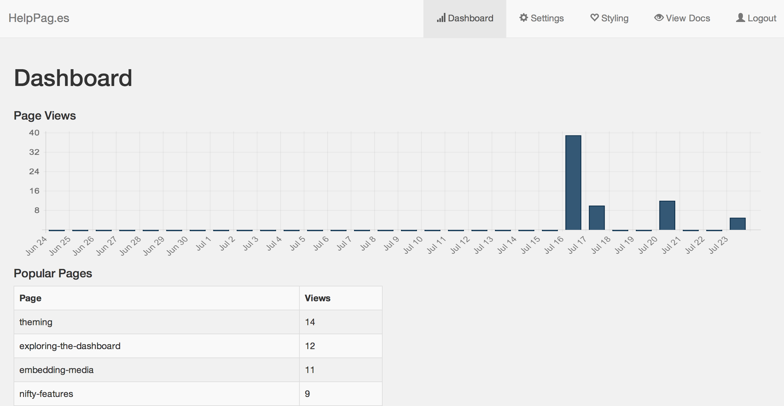
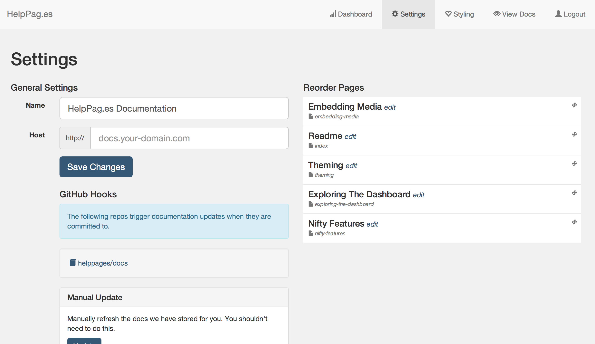
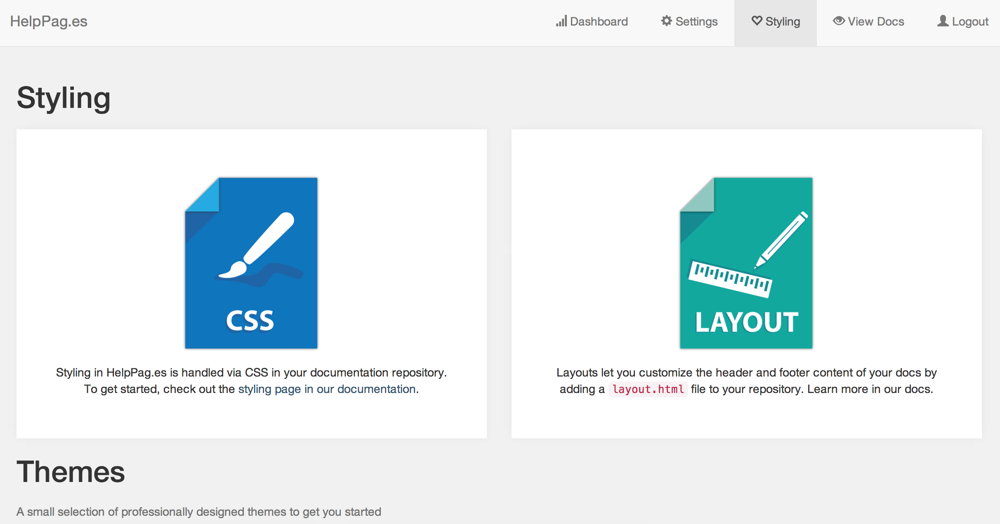

# Exploring the Dashboard
The HelpPag.es dashboard is a simple interface that was built to provide a general overview of your documentation system - as well as enable a few features we wanted to offer but couldn't via a GitHub repo.

## Dashboard

The dashboard provides some awesome insights into how many people are utilizing your docs and which pages they find most useful.  At first there won't be much here, but it'll start to fill out as people utilize your info.

## Settings

Settings is the place to go for reordering and renaming your pages, as well as setting your documentation title and custom domain.  To learn more about how to setup a custom domain, check out the [custom domain docs](/custom-domain).

## Styling

The Styling page is meant to provide an overview of the few of the options you have for customizing the look and feel of your docs.  Also on this page are some professionally designed templates meant to help you get started.  To learn more about customization, checkout the [theming docs](/theming).
