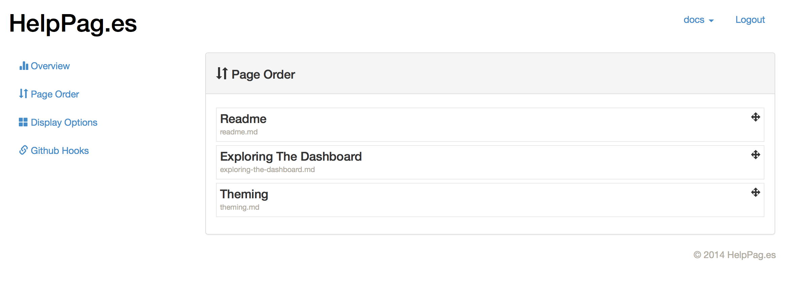
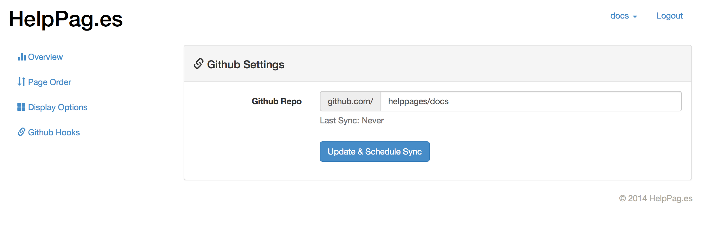

# Exploring the Dashboard
The HelpPag.es dashboard is a simple interface that was built to provide a general overview of your documentation system - as well as enable a few features we wanted to offer but couldn't via a GitHub repo.

## Reordering Pages

First and foremost, reordering pages.  If you'd like to change the order that pages appear in inside the navigation menu, just head to your dashboard and click on "Reorder Pages".  You can then drag pages into the desired order.  Changes are immediate.

## Display Options

Display options is the place you want to go to change your documentation title, alter your base theme or change other basic styling options.  For more powerful styling, you'll want to take a look at our [theming docs](/theming.md).

## Github Settings

The dashboard is also where you'll be given the chance to manage your GitHub settings.  This is the place to go to set the root repo, schedule a manual sync or manage your automatic sync settings.  Honestly, there shouldn't be much need to go here once you're all setup, but it's there for you all the same!